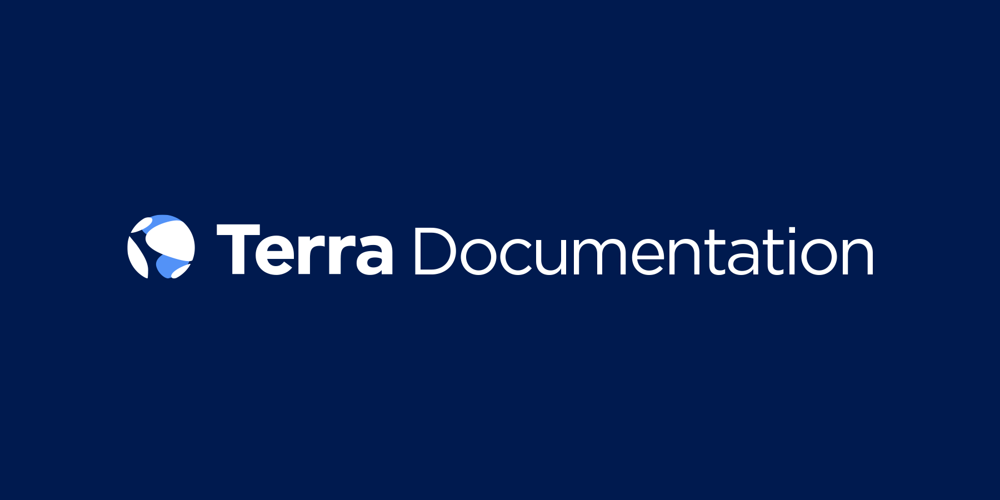

# Terra Documentation

Contains the white paper, high level directives and specifications for the Terra Protocol. 

## Status

White paper 1.0 defines the Terra Protocol as it will be implemented in the [Columbus Mainnet](https://www.github.com/terra-project/core). 

## Disclaimer

No Terra documentation contained herein is intended to be investment advice of any kind. Please read the [disclaimer](./DISCLAIMER.md). 

## Contents

Terra documentation currently contains the white paper and the stability analysis. 

- [White paper](./white-paper/terra-v1.0.pdf) defines the high level motivation and specs for the Terra Protocol. 
- [Stability Analysis](./stability-analysis/stability-v0.1.pdf) publishes our stability analysis of the current Terra Protocol. 